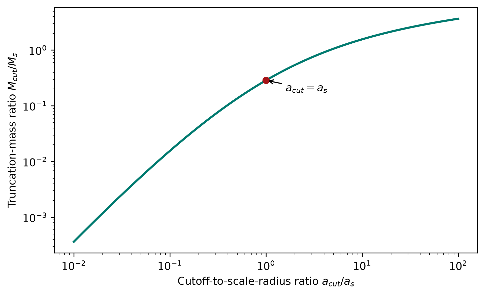

# Aspendos

## Scientific purpose

Aspendos provides focused dark-matter and cosmology calculations shared across the astrophysics ecosystem. Its current supported surface is the dimensionless truncation-mass kernel used by the Chalcedon lensing library and the PCAT probabilistic-cataloging pipeline.

## Installation

```bash
python -m pip install -e ".[plotting]"
export ASPENDOS_PATH=/path/to/aspendos
```

`ASPENDOS_PATH` identifies the repository root. Runtime inputs belong under `data/` and generated pipeline outputs belong under `visuals/`. Both directories are ignored by Git.

## Truncation-mass kernel

`retr_mcutfrommscl()` calculates the enclosed truncation-mass ratio from the positive cutoff-to-scale-radius ratio. The function accepts scalars or NumPy arrays.

```python
import numpy as np

from aspendos import retr_mcutfrommscl

radius_ratio = np.logspace(-2, 2, 200)
mass_ratio = retr_mcutfrommscl(radius_ratio)
```

Run the example from the repository root:

```bash
python examples/plot_truncation_mass.py --typefileplot png
```



The figure is a direct evaluation of the analytic library function. It shows how extending the cutoff radius monotonically increases the enclosed mass relative to the profile scale mass.

