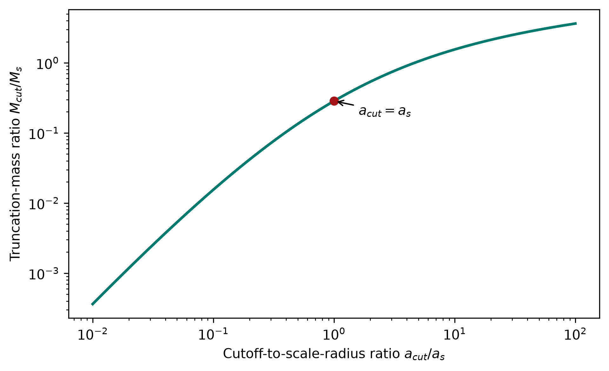

# Aspendos

## Purpose

Aspendos calculates dark-matter and cosmological quantities for lensing and probabilistic-cataloging analyses. Its current interface converts a positive cutoff-to-scale-radius ratio into the dimensionless mass enclosed by a truncated halo profile.

**Note:** the truncated-halo mass kernel (`retr_mcutfrommscl`, `retr_mcut`) is implemented in [Chalcedon](../chalcedon), the ecosystem's upstream gravitational-lensing library. Aspendos re-exports it for backward compatibility.

## Installation

```bash
python -m pip install -e ".[plotting]"
export ASPENDOS_PATH=/path/to/aspendos
```

`ASPENDOS_PATH` identifies the repository root. Runtime inputs belong under `data/` and generated pipeline outputs belong under `visuals/`. Both directories are ignored by Git.

## Truncation-mass kernel

`retr_mcutfrommscl()` calculates the enclosed truncation-mass ratio from the positive cutoff-to-scale-radius ratio. The function accepts scalars or NumPy arrays.

```python
import numpy as np

from aspendos import retr_mcutfrommscl

radius_ratio = np.logspace(-2, 2, 200)
mass_ratio = retr_mcutfrommscl(radius_ratio)
```

Run the example from the repository root:

```bash
python examples/plot_truncation_mass.py --typefileplot png
```



The figure is a direct evaluation of the analytic library function. It shows how extending the cutoff radius monotonically increases the enclosed mass relative to the profile scale mass.

